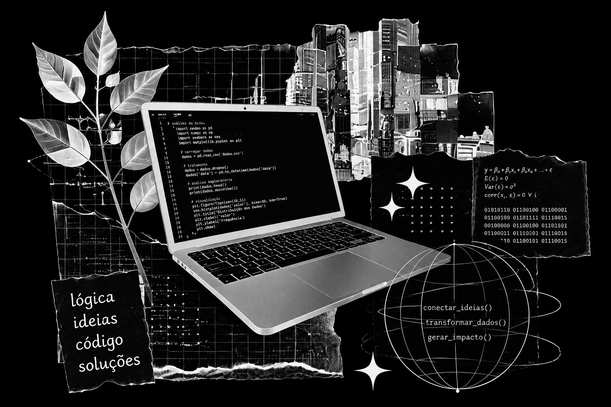
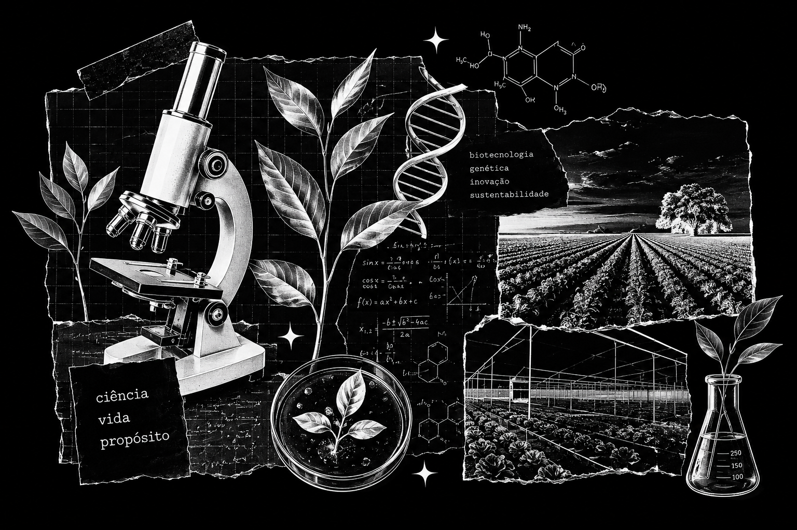

# Olá, eu sou a Caroline

## Dados, Estatística e IoT

Estudante de Ciência da Computação com interesse em Ciência de Dados, Estatística, Internet das Coisas (IoT) e automações.

Busco transformar dados em soluções inteligentes, conectando tecnologia e o mundo real por meio da análise de informações, integração entre sistemas e desenvolvimento de soluções capazes de gerar impacto.

 

---

## Biotecnologia e Agro

Também venho aprofundando meus estudos em biotecnologia e aplicações voltadas ao agronegócio.

Tenho interesse em genética vegetal e em como a tecnologia e a ciência podem contribuir para o desenvolvimento de culturas mais eficientes e sustentáveis.

 

---

  

